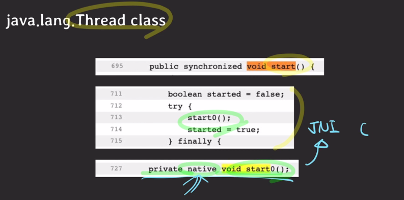

- 유저모드
  - 우리가 개발하는 프로그램은 일반적으로 유저 모드에서 시행
- 유저모드 -> 커널모드
  - 프로그램 실행 중에 인터럽트가 발생하거나 시스템 콜을 호출하게 되면 커널모드로 전환
- 커널모드
  - 프로그램의 현재 CPU 상태를 저장함
  - 커널이 인터럽트나 시스템 콜을 직접 처리, 즉 CPU에서 커널 코드가 실행됨
  - 처리가 완료되면 중단됐던 프로그램의 CPU 상태를 복원
- 커널모드 -> 유저모드
  - 다시 통제권을 프로그램에게 반환
- 유저모드
  - 프로그램이 이어서 실행됨

---

- 커널
  - 운영체제의 핵심
  - 시스템 전반을 관리/감독하는 역할
  - 하드웨어와 관련된 작업을 직접 수행
- 커널 모드를 만든 이유
  - 시스템을 보호하기 위해
- 인터럽트
  - 시스템에서 발생한 다양한 종류의 이벤트 혹은 그런 이벤트를 알리는 메커니즘
  - 종류
    - 전원에 문제가 생겼을 때
    - IO 작업이 완료됐을 때
    - 시간이 다됐을 떄 (timer관련)
    - 0으로 나눴을 때
    - 잘못된 메모리 공간에 접근을 시도할 때
  - 인터럽트 발생하면 CPU에서는 즉각적으로 인터럽트 처리를 위해 커널 코드를 커널 모드에서 실행

---
- 시스템 콜
  - 프로그램이 OS 커널이 제공하는 서비스를 이용하고 싶을 때 시스템 콜을 통해 실행
  - 종류
    - 프로세스/스레드 관련
    - 파일 IO 관련
    - 소켓 관련
    - 장치(device) 관련
    - 프로세스 통신 관련
  - 시스템 콜이 발생하면 해당 커널코드가 커널 모드에서 실행

---
- 시스템 콜 & 인터럽트 예제 : 파일 read

- t1, t2, 싱글코어 CPU
- t1 이 실행중이고 t2 가 기다리는중
- t1이 파일을 읽기 위해 시스템 콜
- 커널모드로 전환
  - t1의 cpu 상태 저장(커널에)
  - 파일을 읽을 버퍼를 준비
  - read는 블락 시스템 콜이기때문에 read 실행 중엔 t1은 파일을 읽을 준비가 될 떄 까지 waiting 상태가 됨
  - CPU가 빔
  - t2가 ready 상태에서 running 상태로 옴
- 유저모드로 전환
  - t2 할일 중..
  - t1이 아까 읽으려던 파일 읽을 준비가 됐다고 알려줌 (인터럽트)
- 커널모드로 전환(인터럽트를 처리하기 위해)
  - t2의 cpu상태 저장, t1의 상태를 ready로 변경
  - t2의 cpu 상태 복원
- 유저모드로 전환
  - t2는 아까 중단한 부분부터 시작
  - 본인의 타임 슬라이스 다씀
    - 인터럽트 발생
- 커널모드로 전환
  - t2의 cpu 상태 전환 -> ready
  - t1가 running 상태가 됨
  - t1의 cpu상태 복원
- 유저모드로 전환
  - t1 실행 -> 파일 이어서 읽음

---

- 프로그래밍 언어와 시스템 콜
  - 하드웨어 혹은 시스템 관련 기능은 어떤 프로그래밍라도 반드시 시스템 콜을 통해서만 가능
  - 하지만 우리가 개발할 때 직접 시스템 콜을 한적은 없음
  - 그럼에도 우리는 지금까지 파일IO, 네트워크IO, 프로세스/스레드 관련 작업을 해왔다.
  - 어떻게 가능했을까
    - 우리가 사용하는 프로그래밍 언어들이 시스템 콜을 포장(wrapping)하여 간접적으로 사용할 수 있도록 제공했기 때문
    - new Thread(), thread.start
    
    - `native` 키워드 -> JNI(java native interface)를 통해서 OS의 시스템 콜을 호출