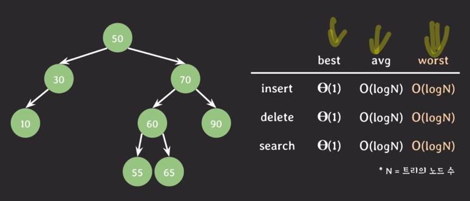
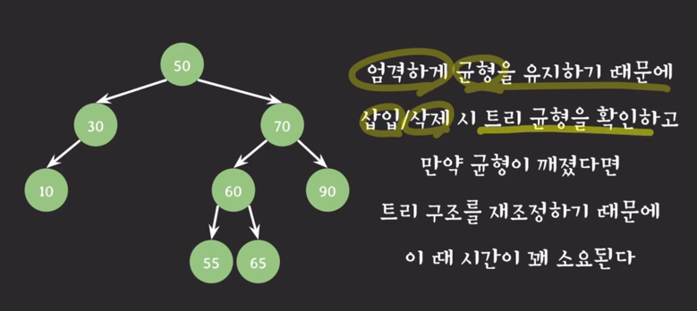
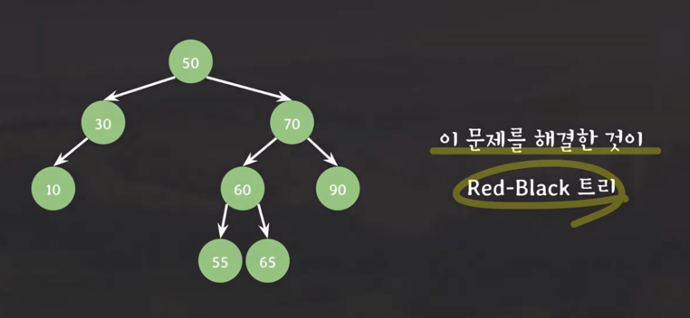

## AVL 트리
- 이진 탐색 트리의 한 종류
- 스스로 균형을 잡는 트리
- balance factor 를 통해 균형 유지
  - 노드의 balance factor
    - 임의의 노드 x에 대해서 [왼쪽 서브트리의 높이] - [오른쪽 서브트리의 높이]
  - AVL 트리의 모든 노드들은 balance factor 가 {-1,0,1} 임
- AVL 트리의 균형잡기
  - 트리에 삽입 혹은 삭제 후
    - BF(x) != {-1,0,1} 노드가 생기면 균형을 맞추는 작업 실행
  - 삽입 삭제를 위해서 루트 노드에서 적절한 위치까지 찾아가서 처리를 해주고
    - 삽입/삭제가 발생한 위치에서 루트 노드로 거꾸로 올라오면서 BF를 확인하여 균형이 깨졌다면 재조정을 해준다.
  - 시간 복잡도
    - 
    - worst case가 BST에 비해 개선됨
    - 
    - 