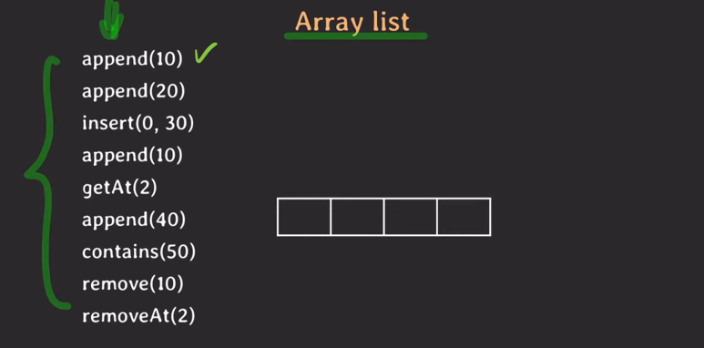
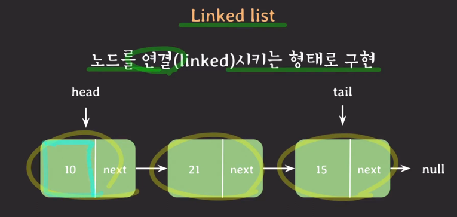
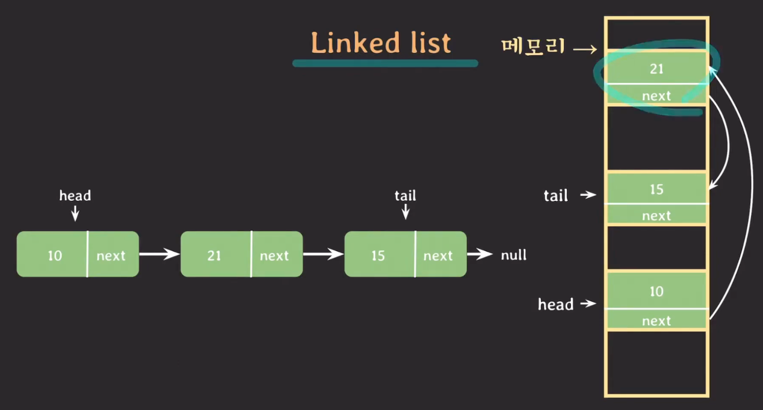
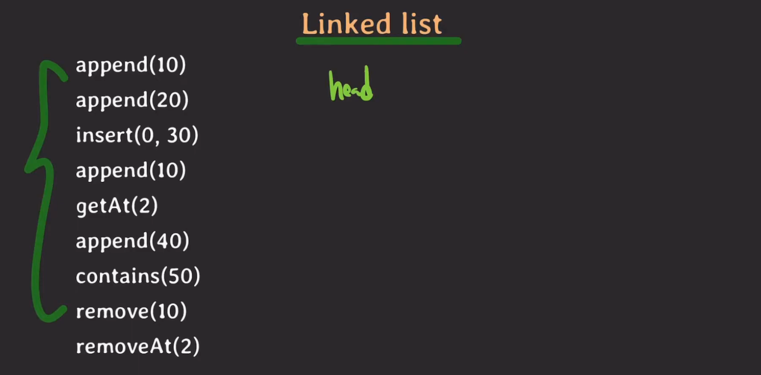
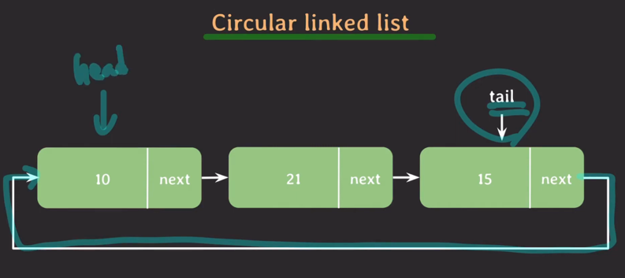
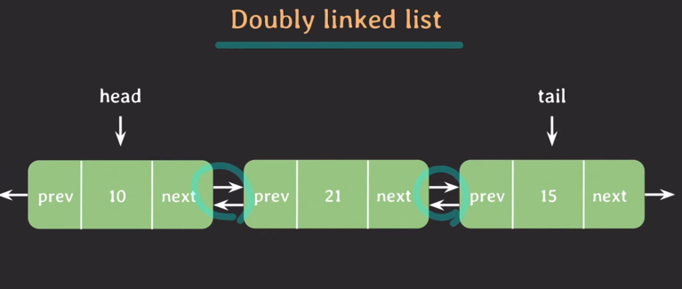
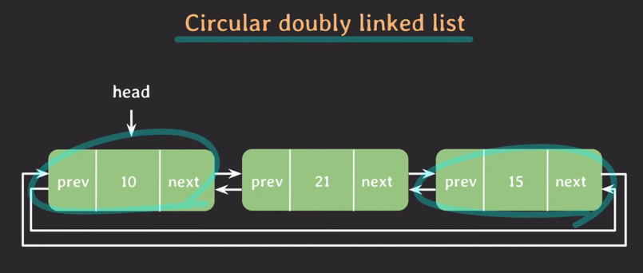
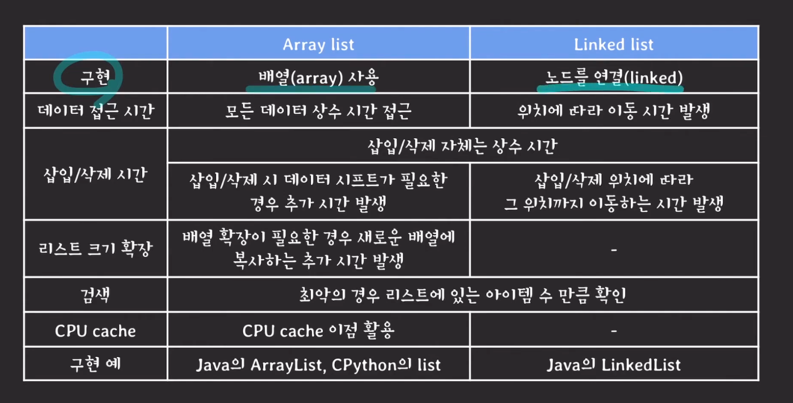

## ADT 관점에서 리스트
- 값들을 저장하는 추상 자료형
- 순서가 있음
- 중복을 허용

### 리스트는 언제 쓸까?
Set이나 Map을 사용하는게 더 적절한 상황이 아니라면, 거의 대부분 List를 사용한다고 봐도 무리 없다.

## List 구현체
### Array List
- 배열을 사용하여 리스트를 구현
- 동작들
  - 

### Linked List
- 노드를 연결시키는 형태로 구현
- 
- 메모리엔 따로따로 저장되어 있음
  - 
- 동작들
  - 
- 확장팩들
  - circular linked list
    - 
    - tail 하나만으로 head 설정 가능
  - doubly linked list
    - 
    - 양방향 가능
  - circular doubly linked list
    - 
    - head - tail 연결되어 있으면서도 양방향 이동가능

## ArrayList vs Linked list

- 검색 -> 특정 값이 있는지 확인