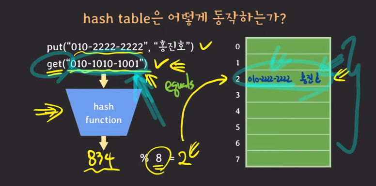
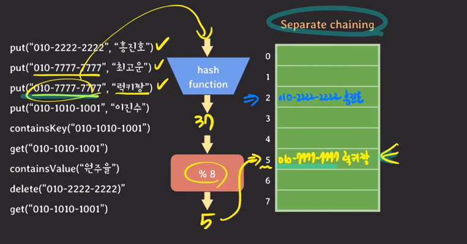
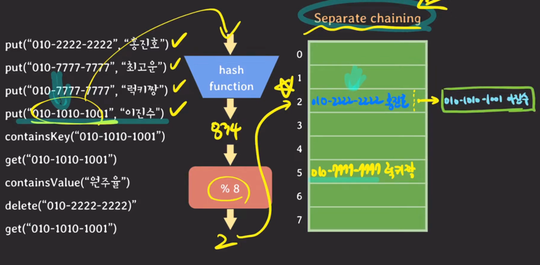
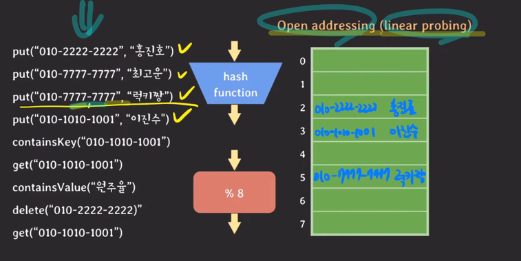
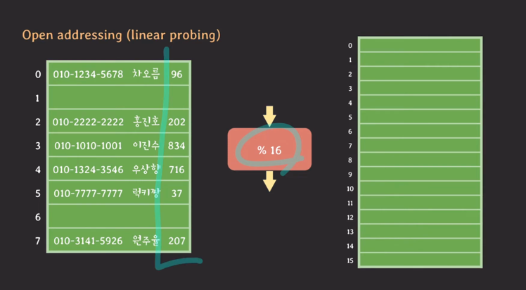
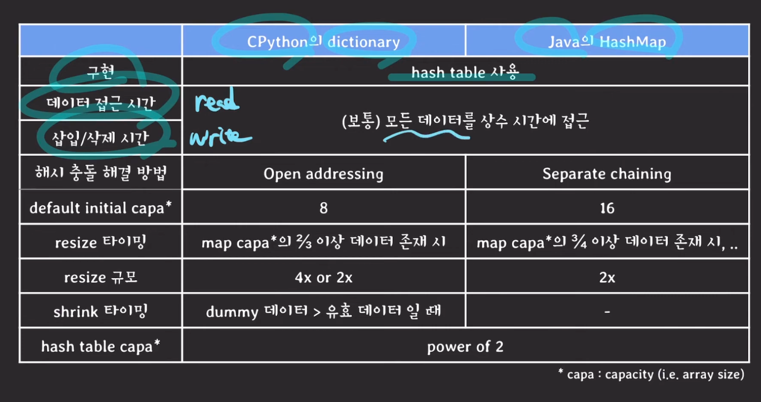

## Map
- key-value pair들을 저장하는 ADT
- 같은 키를 가지는 페어는 최대 한 개만 존재
- associative array, dictionary라고 불리기도 함

### Map의 구현체
- hash table
- tree-based

## Hash Table
- 배열과 해시 함수를 사용하여 map을 구현한 자료 구조
- (일반적으로) 상수 시간으로 데이터에 접근하기 때문에 빠름

### Hash function
- 임의의 크기를 가지는 타입의 데이터를 고정된 크기를 가지는 타입의 데이터로 변환하는 함수
- 해시 테이블에서 임의의 데이터를 정수로 변환하는 함수

### 해시 테이블은 어떻게 동작하는가?
- 해시함수의 결과 값과 key값을 배열에 저장
- 만약 해시함수를 거쳐서 배열에 도착하였는데, 이미 그 자리에 다른 데이터가 존재한다면
  - 

### 해시 충돌
- 키는 다른데 해시가 같을 때
  - 피할 순 없음, 최대한 아웃풋이 균등하게만 설정해주자
- 키도 해시도 다른데 (hash % map_capacity) 의 결과가 같을 때

### 해시 충돌 해결 방법
- Seperate Chaning 방식
  - 
    - 이미 "최고운"이 저장되어 있었는데 그 다음 "럭키짱"이 똑같은 배열의 자리를 배정받으므로 "럭키짱"으로 덮어씀
    - 둘의 키는 같으므로 덮어 쓰는거임!
  - 
    - 이미 "홍진호"가 배열의 2 인덱스에 저장되어 있었는데, "이진수"를 해시로 돌렸더니 2가 나옴
    - 이미 2 자리에 홍진호가 있고, 둘의 키도 다르니까 어떻게 처리할까
    - 배열의 한 자리를 linked list로 구현하여 사진처럼 홍진호 뒤에 이진수를 붙인다.
  - 키로 해당 value가 있는지 찾기
    - 키를 해시로 돌려서 배열에 접근, 해당 키를 갖는 데이터를 linked list를 돌며 탐색하여 반환
  - value로 해당 키 찾기
    - 배열 다 돌면서 확인할 수 밖에 없음
  - 키로 삭제하기
    - 키를 해시 돌려서 나온 배열 인덱스에 접근하여 링크드 리스트 탐색하여 지움

 

- Open addressing (linear probing) 방식
  - 해시 돌렸더니 이미 배열의 자리에 값이 존재. but 둘의 키는 다른 경우
    - 
    - "이진수"의 자리는 원래 2번이지만, 홍진호가 있으므로 그 다음 자리인 3번에 넣음
  - 키를 통해 값을 찾을 떄(이진수)
    - 배열의 인덱스에 접근해서 없다고 끝이 아니라, 다음 인덱스에도 접근하여 확인
  - 키를 통해 값을 지울 때(홍진호)
    - 홍진호를 지우고, "이진수"를 2번으로 옮겨주거나 더미데이터를 넣어줌(여기 자리 주인 다른데 있어요)

### hash table resizing
- 데이터가 많이 차게 되면 크기를 늘려줘야 한다.
- 
  - 자바는 자리가 75%차면 배열을 늘림(capacity를 늘림)
  - 위 그림처럼 해시도 같이 저장함
  - 그래서 "이진수"도 해시를 저장해두었기 때문에 resizing 시에는 제자리를 찾아감

---
