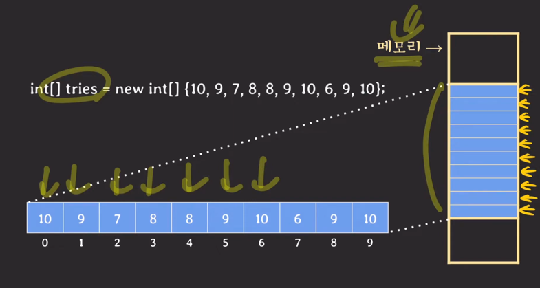

## 배열(Array)
- 같은 타입의 데이터들을 저장하는 자료 구조
- `연속된 메모리 공간`에 데이터들을 저장
- 데이터들 각각은 이름이 없지만 인덱스로 접근 가능
- 인덱스
  - 0 번째 원소부터 몇 번째 떨어져있는 원소인가를 나타냄(offset 개념)
- 메모리 공간
  - 베열 내의 값들은 연속된 메모리 공간을 사용함
  - 
- 2차원 배열의 메모리 공간
  - 실제론 1차원임
  - 
- 객체를 배열에 담았을 땐?
  - 
  - 배열에 객체들의 레퍼런스(메모리 주소)를 저장함
  - 이 주소들은 당연히 메모리의 연속적인 공간에 저장됨

---
- Array
  - 연속된 메모리 공간에 데이터들을 저장하기 때문에
  - Cpu cache를 통해 같은 배열에 있는 다른 데이터에 접근하는 시간을 줄일 수 있다.
## Dynamic array(동적배열)
- 크기가 변할 수 있는 array
- 데이터를 더하거나 빼는 것이 가능한 자료 구조
- resizable array, array list 등등으로 불림
- 작동 방식
  - 
  - 위의 두번째 그림처럼 배열이 다 차면 더 큰 사이즈의 배열을 복사해서 거기에 옮기고 그 뒤에 다음 값을 저장

## Associative array(연관 배열)
- key-value pair들을 저장하는 ADT
- 같은 키를 가지는 pair는 최대 한 개만 존재
- map, dictionary라고 불리기도 함
- 