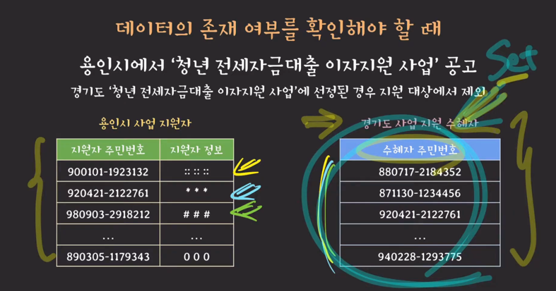
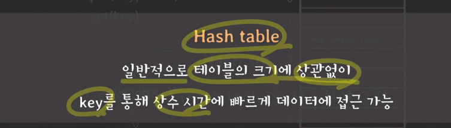
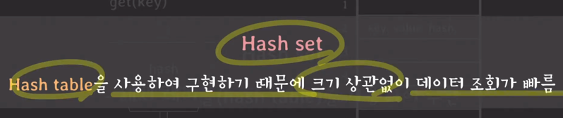
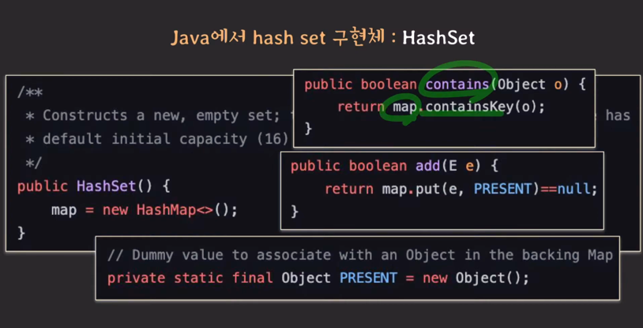
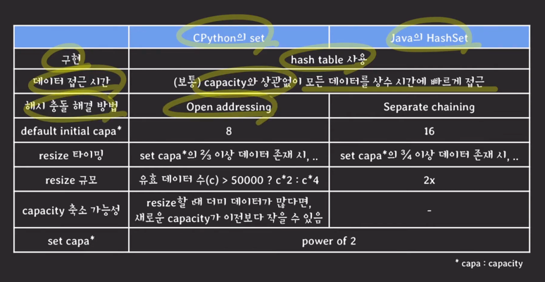
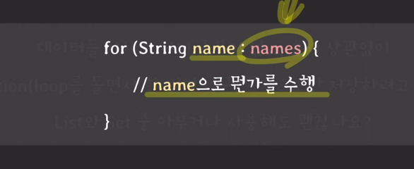
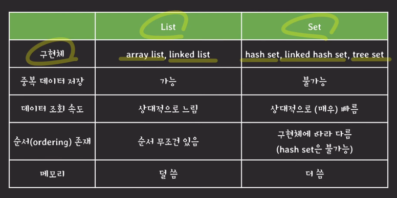

## Set
- 데이터를 저장하는 추상자료형
- 순서를 보장하지 않음
- 데이터 중복을 허용하지 않음
- 데이터 조회가 List보다 빠르다

### 언제씀?
- 중복된 데이터를 제거해야 할 때
- 데이터의 존재 여부를 확인해야 할 때
  - 

### Set 구현체
- hash set
- linked hash set(java)
- tree set(java)

## Hash Set
- 해시 테이블을 사용하여 구현
- 
- 
- 
  - value에 그냥 더미데이터 넣은 해시 테이블임

---

## 리스트와 셋중 무엇을 쓸까?
- Set을 사용하는게 더 적절한 상황이 아니라면, 거의 대부분 List를 사용한다고 봐도 무리 없다.
- 데이터들 자체가 이미 중복이 없고, 순서 상관없이 iteration 목적으로만 저장하려고 한다면 List와 Set 중 아무거나 사용해도 되는가?
  - 
- 리스트가 메모리도 적게 쓰고(해시 저장안함), 구현 특성 상 리스트가 단순하여 iteration이 더 빠르기 때문에 list를, 특히 arrayList 를 쓰는 것을 추천함
- 배열은 메모리에 순차적으로 저장되어 있어서 빠른데, 해시 셋은 메모리에 데이터가 띄엄 띄엄 저장되어 있기 때문에 순차적으로 돌면서 이 주소에는 없네? 하는 오버헤드가 발생함
  - 자바엔 Linked hash set이 존재하긴 함. 값들을 링크드 리스트로 연결해둬서 위의 내용의 오버헤드 안나게 한것

---
