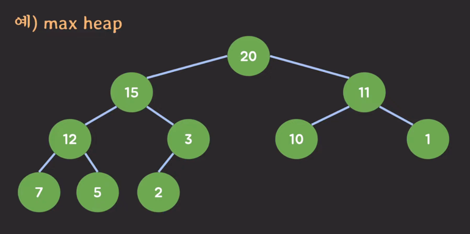

## Priority queue(우선순위 큐)
- 큐와 유사하지만 우선순위가 높은 아이템이 먼저 처리됨
- 주요 동작
  - insert
    - 우선순위 정보도 같이 넣어줘야함
  - delete
    - 우선순위 가장 높은 아이템 삭제
  - peek

### Heap(힙)
- 힙은 주로 이진 트리(Binary tree) 기반으로 구현
- max heap
  - 부모 노드의 키가 자식 노드의 키보다 크거나 같은 트리
  - 
- min heap
  - 부모 노드의 키가 자식 노드의 키보다 작거나 같은 트
- 주요 동작
  - insert
    - 힙에 아이템을 집어 넣음
  - delete
    - max heap이라면 가장 큰 값을 집어내고, 반대면 가장 작은 값.
  - peek

## priority queue와 heap의 관계
- 힙의 키를 우선순위로 사용한다면
  - 힙은 우선순위 큐의 구현체가 된다.
- 따라서, 
  - 우선 순위 큐는 ADT이고, 힙은 data structure 이다.

## 우선순위 큐와 힙의 사용 사례
- 프로세스 스케쥴링 (우선순위 기반 스케쥴링)
  - CPU를 선점하지 못한 프로세스들은 ready queue에 들어가 있음
  - 이 큐가 FIFO큐가 아니라 Priority큐라면, 가장 우선순위가 높은 프로세스가 나와서 CPU에서 실행되게 된다. 
- heap 메모리의 힙은 오늘 배운 힙과는 관련 없다.