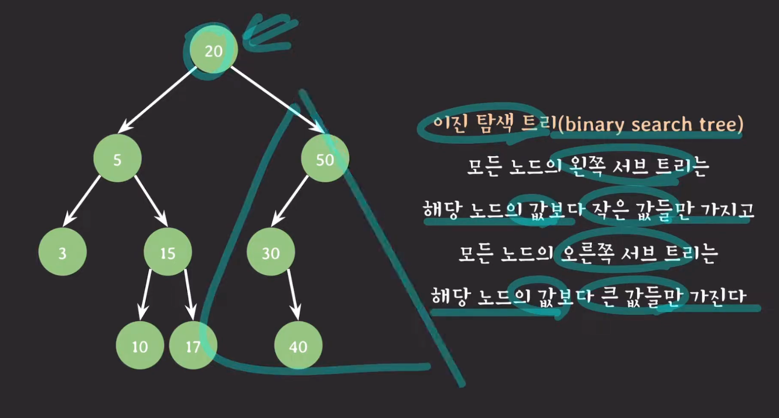
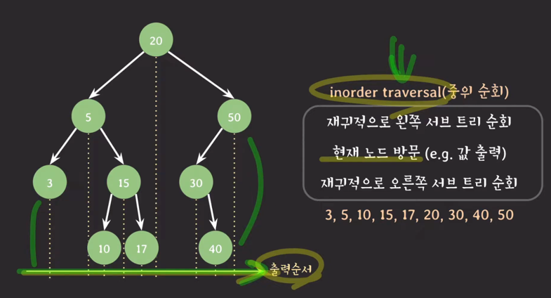
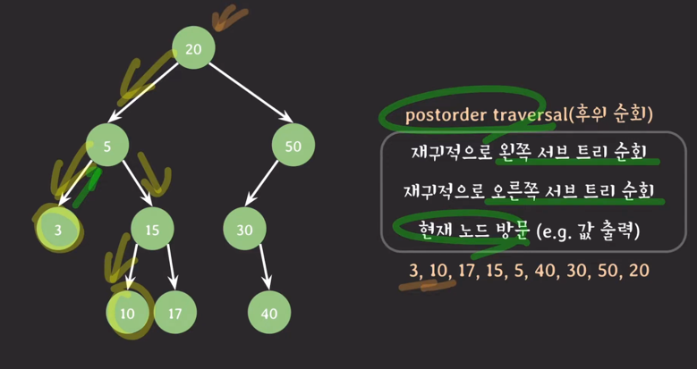
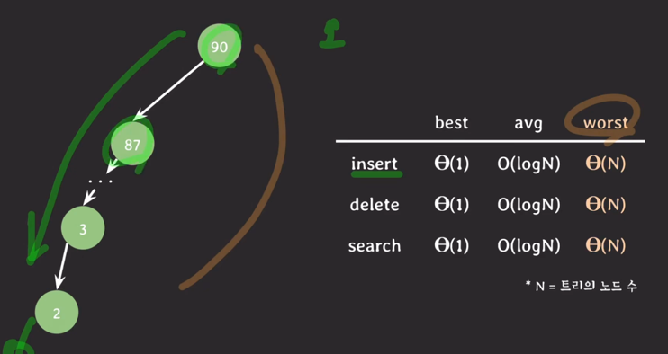

## 이진 탐색 트리 (binary search tree)

---
- 이진 탐색 트리의 최소값은 트리의 가장 왼쪽에 존재
  - 최대값은 가장 오른쪽
- 순회
  - 
  - 

- 시간 복잡도
  - 
- 장점
  - 삽입 삭제가 유연하다
  - 값의 크기에 따라 좌부 서브트리가 나눠지기 때문에 삽입/삭제/검색이 보통은 빠르다
  - 값의 순서대로 순회 가능하다
- 단점
  - 트리가 구조적으로 한쪽으로 편향되면 삽입 삭제 검색 등등 여러 동작들의 수행 시간이 악화된다. (대안 : avl, red-black 트리)