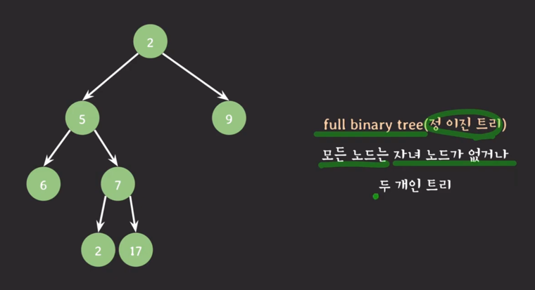
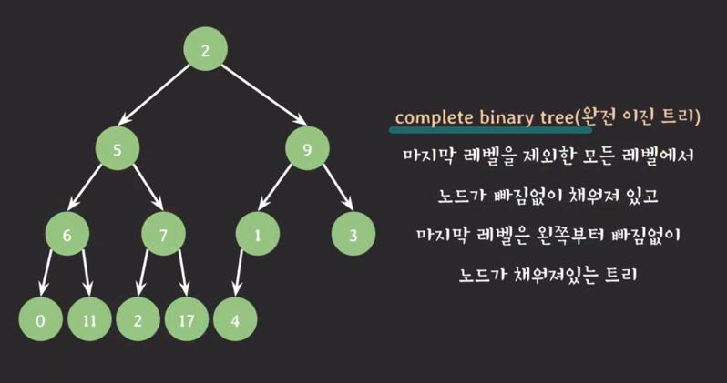
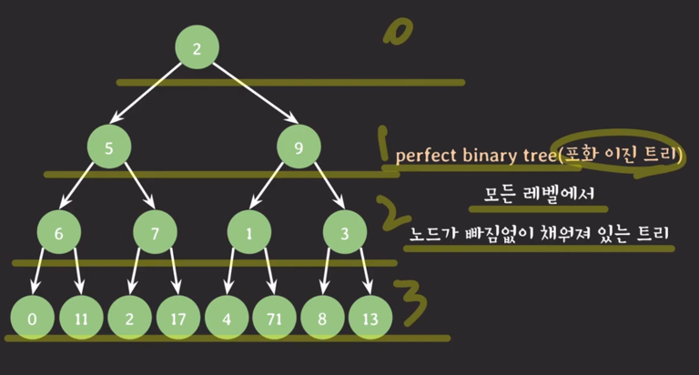
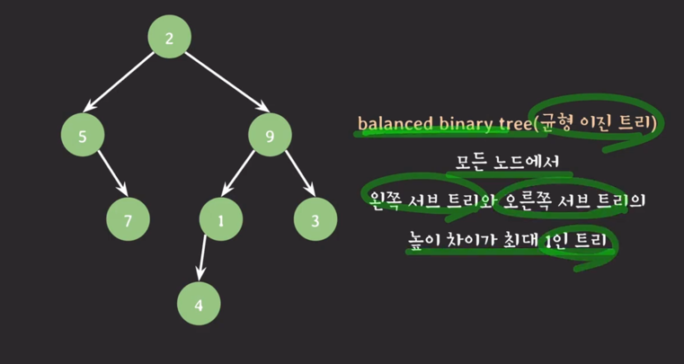

## 트리
- 노드들의 집합
- 각 노드는 값과 다른 노드들을 가리키는 레퍼런스들로 구성
- 주요 용어
  - 간선
    - 노드와 노드를 연결하는 선, 구현 관점에서는 레퍼런스를 의미
  - 루트 노드
    - 트리의 최상단에 있는 노드, 트리의 시작점
  - 자녀 노드
    - 모든 노드는 0개 이상의 자녀 노드를 가진다
  - 부모 노드
    - 자녀 노드를 가지는 노드
  - 형제 노드
    - 같은 부모를 가지는 노드들
  - 조상 노드
    - 부모 노드를 따라 루트 노드까지 올라가며 만나는 모든 노드
  - 자손 노드
    - 자녀 노드를 따라 루트 노드까지 올라가며 만나는 모든 노드
- 특징
  - 데이터를 순차적으로 저장하지 않는 비선형구조
  - 트리에 서브 트리가 있는 재귀적 구조
  - 계층적 구조

## 이진트리(binary tree)
- 각 노드의 자녀 노드 수가 `최대 두 개`인 트리
- left child, right child
- 종류
  - full binary tree(정 이진 트리)
    - 
  - complete binary tree (완전 이진 트리) 
    - 
  - perfect binary tree (포화 이진 트리)
    - 
  - balanced binary tree (균형 이진 트리)
    - 
  - 