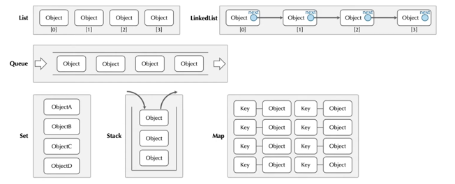
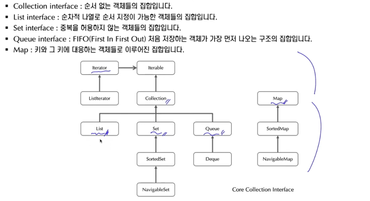

## Java Collection Framework의 이해
- Java Collection Framework는 객체들을 관리하기 위해 사용하는 컨테이너 클래스들의 집합이다.
- 컨테이너 클래스들의 종류는 크게 List, Set, Queue, Map 계열로 구분한다.
- 각 계열에 따라 객체들을 저장하고 관리하는 방식에 차이가 있다.

- 컬렉션 관련 인터페이스들과 클래스들은 java.util.* 패키지에 포함되어 있다.

