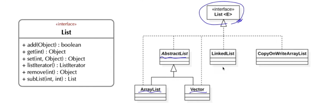
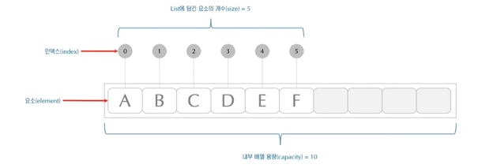

## List 인터페이스
- List 계열의 컬렉션은 저장 요소를 순차적으로 관리하며 중복된 값과 null 값을 요소로 가질 수 있다.
- 요소에 대한 접근은 배열과 마찬가지로 인덱스를 통해 접근한다.
- 배열 자료구조 형태로 데이터를 저장할 때 저장 데이터의 특성에 따라 적절한 List 계열의 클래스들을 활용합니다.
- List 인터페이스를 구현한 대표클래스는 ArrayList, LinkedList, Vector 클래스가 있다.

## ArrayList 클래스
- 내부에 배열을 갖고 있다. 따라서 고정 길이 저장 공간으로 요소들을 관리한다.
- 내부 배열이 요소를 담을 수 있는 용량을 capacity 라고 한다.
- 내부 배열의 용량을 넘어 요소를 저장할 경우 내부적으로 용량을 늘린 새로운 배열을 만들어 요소를 담는다.
- 요소에 대한 접근은 배열과 마찬가지로 인덱스를 통해 접근한다.

## LinkedList 클래스
- 집합하는 각 요소들을 노드로 표현하고, 각 노드들을 서로 연결하여 리스트를 구성한다.
  - 연속된 주소 아님
- 요소를 갖는 각 노드들은 다음 노드에 대한 참조 정보를 통해 접근한다.
- 노드는 필요할 경우 만들어서 연결하여 사용하기 때문에 미리 정의된 용량(capacity)의 개념이 없다.
- 인덱스를 통해 요소에 접근한다.
- ArrayList와 달리 요소의 추가, 삭제에 대한 부하가 적은 반면 메모리의 사용은 더 많다는 특징을 갖는다.
  - LinkedList는 앞,뒤의 노드에 대한 참조 값도 가져야 하므로 메모리 더 씀