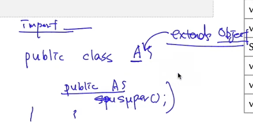
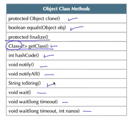
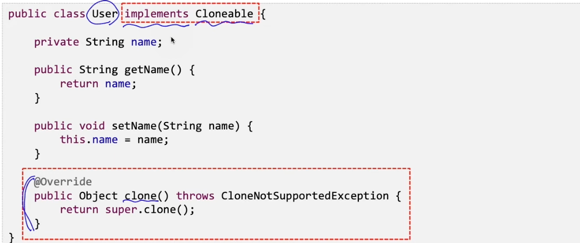
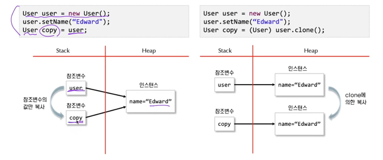

## 개요
- 모든 자바 클래스가 상속하는 최상위 클래스
- 모두 11개의 메서드를 정의하고 있으며 이 메서드들은 자바의 모든 클래스가 갖는 기능이다.
- 자바의 모든 클래스가 상속 받아 갖는 Object 클래스 메서드에 대한 목적과 기능을 이해하는 것이 중요하다.
- Object 클래스를 통해 상속 받는 메서드의 의미를 이해해야 그 의미에 맞게 재정의할 수 있다.

## toString 메서드
- 해당 클래스에 대한 설명을 문자열 타입으로 반환하는 메서드
- 자바의 모든 클래스는 스스로에 대한 정보를 읽기 쉬운 형태로 제공할 수 있으며 이 기능이 toString() 메서드이다.
- 클래스를 정의할 때 그 클래스를 나타내는 주요 정보를 이용해 toString() 메서드를 재정의 한다.

## equals, hashCode 메서드
- 자바의 모든 클래스는 비교가 가능해야 하며, 비교는 해당 클래스의 속성을 기준으로 한다.
- 자바에서 비교는 동일(identity)비교와 동등(equality)비교로 구분된다.
- equals() 메서드는 인스턴스 객체와 파라미터로 전달되는 객체를 같은지 비교하여 그 결과를 반환한다.
- 해시 코드(hashcode)는 객체를 식별하는 정수값을 의미하며 hashCode() 메서드는 이 정수값을 반환하는 메서드이다.

> 참조변수1 == 참조변수2 와 같은 짓은 하지 않는다. -> 참조변수1.equals(참조변수2) 이렇게 해야 옳다.

## clone 메서드
- 인스턴스 객체의 복제를 위한 메서드로, 해당 인스턴스 객체를 복사하여 그 참조값을 반환한다.
- 클래스의 복제를 가능하게 하기 위해선 Cloneable 인터페이스를 재정의 해야 한다.
- Cloneable 인터페이스를 구현(implements) 하지 않은 클래스의 인스턴스의 clone() 메서드를 호출하면 CloneNotSupportedException 예외가 발생한다.

 

- 객체의 복사는 단순히 같은 참조 정보를 복사하는 형태와 동일한 객체의 인스턴스를 복사하는 것의 차이를 이해해야 한다.
- Object 클래스의 clone() 메서드는 protected 접근 권한을 갖고 있으며 이를 재정의 하는 클래스는 이를 public 접근 권한으로 재정의하여 어디서나 복제가 가능하도록 한다.
- 객체의 복제는 얕은 복제, 깊은 복제가 있으며 이를 유의한다.

