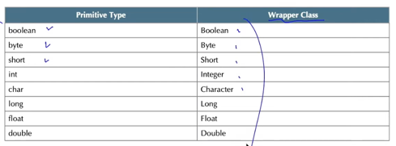
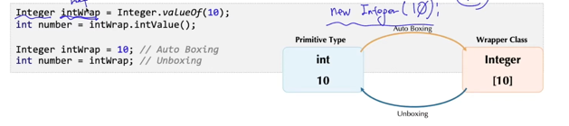
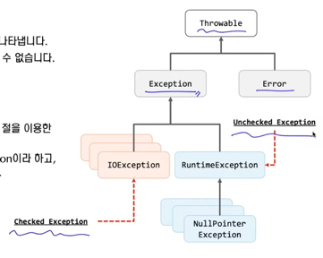

## Wrapper 클래스의 이해
- 자바프로그램에서 관리하는 데이터의 기본 단위는 객체이다.
- 자바에서는 int,double 등과 같은 기본 데이터 타입들을 객체로 관리 할 수 있도록 하는 클래스들을 제공하며, 이 클래스들을 Wrapper 클래스라고 한다.
- Wrapper 클래스들은 기본 데이터 타입에 대한 객체화와 함께 다양한 기능들을 정의하고 있다.

## Auto Boxing, Unboxing
- 기본 데이터 타입을 Wrapper 클래스로 감싸거나 Wrapper 클래스가 갖고 있는 기본 데이터 타입을 다시 꺼내는 과정은 Auto Boxing, Unboxing 기능을 통해 구현할 수 있다.

## 예외처리
- 예외란 프로그램 실행 도중에 발생하는 예외적인 상황이며, 이러한 상황을 처리하는 것이 예외처리이다.
- 자바에선 예외처리를 위한 문법을 제공한다. (try-catch)
- 예외적인 상황이란?
  - 파일을 읽으려고 하는데 해당 파일이 존재하지 않는 경우
  - 나눗셈을 하려고 두 수를 입력받았는데, 나누는 수가 0인 경우

## 예외 클래스의 종류
- 예외 클래스의 종류
  - 예외 클래스의 최상위 클래스는 Throwable 클래스이다.
  - Throwable의 하위 클래스는 Exception과 Error 클래스가 있습니다.
- Error 클래스
  - Error 클래스를 상속한 클래스들은 매우 심각한 오류상황을 나타낸다.
  - 자바프로그램 외에서 발생한 오류로 프로그램 내에서 해결할 수 없다.
    - OutOfMemoryError 등
- RuntimeException
  - Checked Exception 클래스와는 달리, try-catch문 또는 throws 절을 이용한 예외처리가 필요하지 않다.
  - RuntimeException 계열의 예외를 Unchecked Exception이라고 한다.

## 사용자 정의 예외 클래스
- 문법적으로 문제가 되는 상황에선 JVM이 적절한 예외를 발생시킨다.
- 그러나, 논리적으로 문제가 되는 경우엔 상황에 맞는 예외클래스를 직접 작성해야 한다.
- 예외 클래스는 다음과 같이 작성한다.
  - Exception 클래스를 상속한다.
  - 예외클래스의 생성자에 메시지를 추가한다.
- throw 키워드
  - 예외가 발생했음을 JVM에 알리기 위해 사용한다.
  - 문법 : throw 예외클래스의 인스턴스;
- 예외의 전파 (throws)
  - 발생된 예외 상황을 메서드를 호출한 곳으로 전달하기 위해 사용한다.