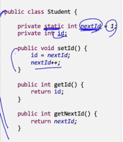
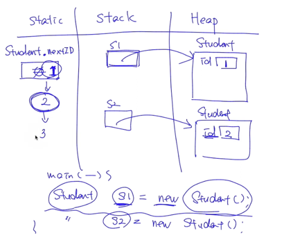

## 개요
- static과 final 키워드는 클래스, 필드, 메서드에 모두 적용할 수 있는 키워드이며 각 위치에 따라 다른 의미를 갖는다.
- static 키워드는 정적 키워드로 정적 필드, 정적 메서드를 선언할 때 사용한다.
- final 키워드를 필드에 정의할 경우 초기 한번의 초기화만 가능하여 이후엔 다른 값을 대입할 수 없다.
- static, final 키워드가 어느 위치에 있느냐에 따라 그 기능이 다른 만큼 정확히 이해하고 사용해야 한다.

## final
- final 키워드는 클래스(상속 금지됨), 필드, 메서드(오버라이딩 금지됨), 지역변수, 파라미터에 적용할 수 있다.
- 클래스에 final은 상속을 허용하지 않으며 메서드의 final은 오버라이딩 금지를 의미한다.
- 필드, 지역변수, 파라미터에 final을 적용하면 한번 초기화 한 이후엔 다른 값으로 변경할 수 없다.
- final 필드의 초기화 방식은 `필드 선언 시점`의 초기화, `초기화 블록`, `생성자를 통한 초기화 방법` 3가지가 있다.

## static field
- static 키워드가 적용된 필드를 정적 필드 혹은 클래스 변수라고 한다.
- 정적 필드는 해당 클래스의 모든 인스턴스 객체들이 공유하는 변수이며 이런 의미가 바로 클래스 변수이다.
  - static 필드는 프로그램 시작 시, static 메모리 영역에 잡혀서 공유하는 데이터이다.
- 정적 필드는 객체의 인스턴스화 없이 클래스 이름으로 정적 필드에 접근할 수 있다.

 

## 사용자 정의 상수
- 정적 필드에 final 키워드를 적용하여 값을 변경할 수 없도록 하는 것으로 사용자 정의 상수를 정의할 수 있다.
- 사용자 정의 상수는 정적 필드나 메서드의 접근과 마찬가지로 클래스 이름을 통해 접근하여 사용한다.
- 사용자 정의 상수는 접근 지정자의 범위에 따라 공유하는 범위가 결정된다.

## static method
- 정적 메서드는 static으로 선언된 메서드로써 인스턴스 없이도 호출할 수 있다.
  - 정적 메서드는 `인스턴스 필드에는 접근할 수 없고`, 정적 필드에만 접근할 수 있다.
    - 정적 필드는 애플리케이션 시작 시 메모리에 깔리기 때문에 언제든 호출 가능하지만, 인스턴스 필드는 객체가 생성된 이후에 메모리에 잡히므로 아직 메모리에 존재하지 않을 수도 있기 때문
  - 정적 메서드는 객체를 통해 사용될 수 있지만, 반드시 클래스 명과 함께 사용한다. (가능하다면 그렇게 해라 항상, 굳이 인스턴스 생성하지 말고.)
- 정적 메서드는 언제 사용할까?
  - 객체의 상태에 접근하지 않고. 필요한 파라미터가 모두 명시적 파라미터인 경우
  - 클래스의 정적 필드에만 접근하는 경우

