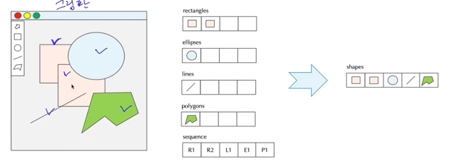

## Strongly typed language
- Strongly typed language(C, java ,..) 개념은 데이터의 타입을 미리 정의하고 사용 하고, `한번 정의된 데이터 타입은 프로그램 종료까지 변하지 않는 것`을 의미.
- 이 개념은 프로그램 개발에 있어 명확함과 구체성을 제공하며 많은 프로그램 언어들이 적용하고 있다.
- 다만, 프로그램의 유연성 제약이라는 단점을 갖고 있고, 반대의 개념은 Loosely typed language(javascript) 이다.

## 자바에서 예외적으로 Strongly typed language가 적용되지 않는 경우
- 상속 관계에서 자식 클래스가 부모 클래스 타입으로 참조되는 것이 허용되며 이를 up-casting이라 한다.
- 한번 부모 클래스 타입의 클래스로 참조가 이루어진 이후 다시 자식 클래스로 참조하는 것을 down-casting이라 한다.
  - (부모 클래스 타입) 자식인스턴스  <- 은 안됨

## up-casting 되어 있을 때, 실제 인스턴스화 객체가 자식 객체일 경우(타입은 부모 클래스)에도 자식 클래스가 갖고 있는 인스턴스 메서드는 호출 불가능하다.
- 부모 클래스 타입의 변수로 참조하고 있는 자식 인스턴스 객체의 메서드를 호출하기 위해선 down-casting이 이루어져야 한다.
- 단, 재정의 하고 있는 메서드의 경우 up-casting 상황에서도 `자식 클래스의 재정의 메서드가 호출`된다. (오버라이딩 된 메서드들)

## 상속 관계에서 객체간의 타입 형변환은 객체를 관리하는데 있어 큰 이점을 제공한다.
- 자식 클래스가 부모 클래스 타입의 변수로 참조가 가능하기 때문에 같은 부모 클래스를 상속하는 모든 자식 클래스들을 하나의 타입으로 관리할 수 있다.
- 이와 같은 객체의 관리는 프로그램의 복잡성을 크게 개선할 수 있다.

## 다형성
- 하나의 객체가 다양한 형태로 처리될 수 있는 특성
- 다형성을 구현하기 위해선 `상속`, `재정의 메서드`, 그리고 `객체간 형변환` 세가지의 조건이 필요하다.

