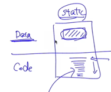
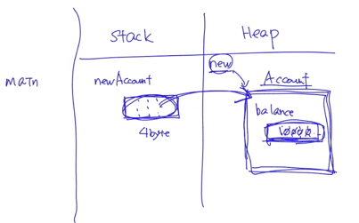
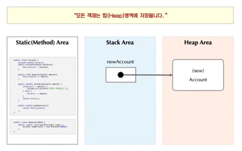

## 자바 메모리 모델
- JVM이 관리하는 메모리 공간은 크게 3가지 영역으로 나눌 수 있다.
  - 스택 영역 (Stack Area)
    - 지역 변수, 매개 변수가 할당되는 영역으로 초기화가 진행되지 않는다.
      - 자동 초기화가 안되기 때문에, `int n;` 과 같이 어떤 값으로도 초기화되지 않은 지역변수를 출력하려고 하면 에러가 발생한다.
  - 힙 영역 (Heap Area)
    - 배열과 모든 인스턴스 객체가 할당되는 영역으로 자동 초기화가 진행된다.
  - 스태틱 영역 (Static Area)
    - 코드 영역과, 데이터 영역으로 나뉜다.
      - 우리가 작성한 코드는 코드영역, static이 붙은 필드는 데이터 영역에 저장된다.
    
        
    - 메서드의 바이트 코드, static 변수가 할당된다.

