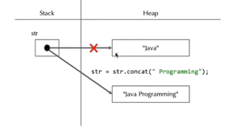
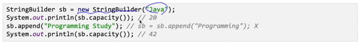
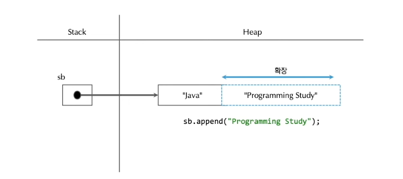
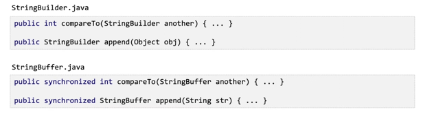

## String 클래스
- 자바는 문자열을 관리하기 위한 여러 클래스를 제공하고 있으며 대표적인 클래스가 String 이다.
- String 클래스는 문자열 제어를 위한 다수의 메서드를 정의하고 있다.
- String은 배열의 형태로 문자열을 관리한다.

## String 클래스 특징
- String 객체의 초기화 방식은 리터럴을 이용한 방식과 객체 생성을 통한 초기화 방식 2가지이다.
- String은 불변의 특성을 갖고 있으며 내부적으로 String Pool을 통해 문자열 상수를 관리한다.
  - String Pool은 힙 영역에 존재한다. 같은 문자열을 갖는 두 인스턴스를 생성하면, 같은 값을 참조하게 만든다.
  - 문자열 비교 시엔 == 사용하지말자
- 문자열의 변경이 빈번한 로직에서 String의 사용은 메모리 누수가 발생할 수 있기 때문에 주의한다.
  - 문자열을 더할땐 concat() 말고 StringBuilder나 StringBuffer 사용
    
    

## StringBuilder, StringBuffer 클래스
- StringBuilder와 StringBuffer 클래스는 동기화(synchronized) 특성을 제외하고 모든 메서드의 기능이 동일하다.
- 이 두 클래스는 String 클래스와 달리 가변의 특성을 갖고 있다.
- 두 클래스는 AbstractStringBuilder 추상 클래스를 상속하고 있으며 이 클래스는 내부적으로 문자열을 관리하기 위한 byte[] 과 배열의 길이를 계산하기 위한 count 속성을 갖고 있다.
- 문자열 더하는 기능을 구현할땐 이 두 클래스를 사용하자.

## StringBuilder와 StringBuffer의 차이
- 둘의 유일한 차이는 동기화 처리 여부이다.
- StringBuffer 클래스는 멀티스레드 프로그램에서 데이터에 대한 동기화 문제가 발생하지 않도록 대부분의 메서드에서 동기화 처리를 하고 있다.
- 이런 동기화 처리 과정은 성능에 영향을 주기 때문에 단일 스레드 프로그램에서는 StringBuilder 클래스를 사용한다.

## +연산자
- 자바의 + 연산자는 피연산자가 문자열일 경우 두 피연산자를 문자열로 연결해 주는 깅을 갖고 있다.
- 문자열의 연결은 String 클래스의 concat(), StringBuilder 클래스의 append()와 동일한 기능이다.
- 자바8까진 문자열 +연산은 StringBuilder 클래스의 append() 기능을 이용해 수행했다.
- 자바9부턴 StringConcatFactory라는 새로운 클래스의 기능을 이용해 문자열에 대한 +연산을 진행한다.