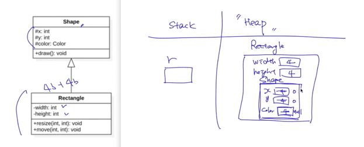
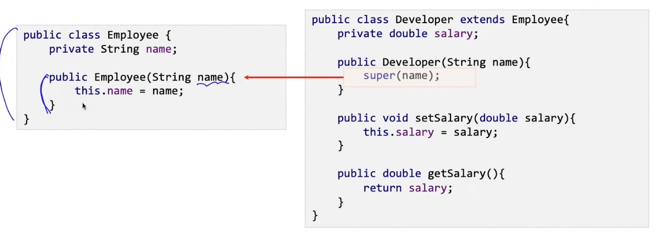

## 개요
- 상속은 연관 있는 클래스들에 대해 공통적인 구성요소를 정의하고, 이를 대표하는 클래스를 정의하는 것을 의미한다.
  - 관리자는 직원이다.(O) 직원은 관리자이다.(X), 관리자는 직원을 상속.
- 상속 관계는 "is a" 관계를 의미하며 extends 키워드를 이용해 상속 관계를 정의한다.
- 상속 관계에서 상속을 받는 클래스를 sub class, derived class, extended class, child class라 한다.
- 상속 관계에서 상속을 제공하는 클래스를 super class, base class, parent class라 한다.

## 상속의 이해
- 자식 클래스는 부모클래스를 상속받아서 부모클래스의 모든 자원(속성, 메서드)을 사용할 수 있다.
  - 상속 관계에 있어도, 부모 클래스의 private 필드나 메서드엔 접근할 수 없다.
- 자식 클래스는 부모 클래스에 없는 필드와 메서드를 정의하여 기능을 추가할 수 있다.
- 또한, 상위 클래스에 정의된 메서드를 재정의하여 다르게 동작시킬 수 있다.(오버라이딩)

## protected
- 상속 대상이 되는 부모 클래스에 protected 접근 지정자로 정의된 구성요소는 자식 클래스 구성요소가 된다.
- 자식 클래스는 부모 클래스의 protected, public 구성요소에 대해 this 접근이 가능하다.
- 즉, 상속관계에서 자식 클래스는 부모 클래스에서 제공하는 구성요소들을 자신의 구성요소로 포함한다.
- 부모 클래스의 private 구성요소는 자식 클래스에서 직접 접근할 수 없다.

## 상속 관계의 초기화 과정(1) - 생성자 호출
- 상속 관계에서 자식 클래스를 인스턴스화 하면 부모 클래스의 객체도 인스턴스화가 진행된다.
- 자식 클래스의 객체가 인스턴스화 되기 위해선 먼저 부모 클래스의 객체가 인스턴스화 되어야 한다.
- 따라서, 상속 구조에서 가장 상위의 부모 클래스부터 차례로 인스턴스화가 진행된다.

### 이유
- 자식 클래스의 생성 시, 부모 클래스의 필드도 필요하므로 메모리의 힙 영역에 부모 클래스의 인스턴스도 할당되어야 함.

## 상속 관계의 초기화 과정(2) - super()
- super() 생성자는 자식 클래스에서 명시적으로 부모 클래스의 생성자를 호출할 수 있도록 하는 방법이다.
- 상속 관계에서 부모 클래스의 생성자 호출을 외부에서 명시적으로 지정할 수 없다.
- 자바는 자식 클래스의 객체가 인스턴스화 될 때 기본적으로 부모 클래스의 디폴트 생성자를 호출한다.
- 부모 클래스에 디폴트 생성자가 정의되어 있지 않다면(사용자가 임의로 생성자를 만들었다면) 자식 클래스는 명시적으로 부모 클래스의 생성자를 호출해야 한다.

