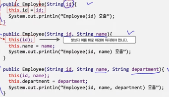

## 생성자
- 클래스의 구성요소 중 하나, 객체를 인스턴스화 할 때 가장 먼저 호출되는 특수한 `메서드`이다.
- 생성자의 역할은 객체가 갖는 필드의 초기화이며 따라서 모든 클래스는 하나 이상의 생성자를 갖는다.
- 생성자의 이름은 해당 클래스의 이름과 같고 반환 타입을 갖지 않는다.
- 생성자도 모든 접근제어자를 적용할 수 있으며 일반적으론 public 접근제어자가 적용된다.

## 디폴트 생성자
- 매개 변수가 없고 구현 내용 없이 정의하는 생성자를 기본 생성자 혹은 디폴트 생성자라고 한다.
- 클래스는 반드시 하나 이상의 생성자를 가지며 사용자가 생성자를 정의하지 않으면 디폴트 생성자가 자동으로 생성된다.
- 생성자에서 명시적으로 필드의 값을 설정하지 않으면 디폴트 값으로 초기화된다.
  - 숫자 타입(0), 논리 타입(false), 참조 타입(null)

## 사용자 정의 생성자
- 클래스 필드의 초기화를 위해 정의하는 생성자
- 사용자 정의 생성자는 해당 클래스가 갖는 필드의 초기화를 위해 정의하며 여러 형태로 정의가 가능하다.
- 만일, 사용자가 하나 이상의 사용자 정의 생성자를 만들었다면 디폴트 생성자는 자동으로 생성되지 않는다.

## 생성자 오버로딩
- 클래스 필드의 초기화는 다양한 방식으로 이뤄질 수 있고, 이를 위해 다양한 형태의 생성자를 정의할 수 있다.
- 생성자의 이름은 항상 클래스명과 같기에, 다수의 생성자 정의는 생성자 오버로딩으로 정의한다.
- 생성자 오버로딩은 해당 클래스를 구성하는 생성자들의 매개변수 개수와 타입, 순서를 달리하여 정의한다.
- 객체의 인스턴스화 과정에서 생성자를 호출하며 이때 전달인자를 다르게 하여 필요한 생성자를 호출한다.

## this
- 하나의 클래스에 정의된 다수의 생성자 간에 this() 생성자를 통해 호출이 가능하다.
- this() 생성자는 중복되는 코드를 제거하고, 생성자를 재사용하기 위해 사용된다.
- this() 생성자의 호출은 반드시 생성자 이름의 바로 아래 위치해야 한다.
    
    

