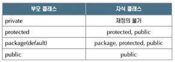

## 메서드 재정의 - 개요
- 메서드 재정의(overriding)는 부모 클래스의 메서드를 자식 클래스가 확장하거나 다시 정의하는 것을 의미한다.
- 메서드 재정의를 구현하는 방법은 부모 클래스로부터 상속받은 메서드의 반환타입, 메서드명, 파라미터를 동일하게 하여 자식 클래스에서 정의한다.
- 자식 클래스가 부모 클래스의 메서드를 재정의할 때 접근 지정자의 범위는 넓거나 같아야 한다.

## 메서드 재정의 - super
- 메서드 재정의는 부모 클래스로부터 상속 받은 기능을 새롭게 변경하거나 확장하기 위해서다.
  - 확장한다면, 부모 클래스의 메서드를 super(메서드명)으로 실행 뒤 다른 로직 수행하면 됨.
- 자식 클래스에서 상속 받은 메서드의 기능을 확장하기 위해선 부모 클래스의 메서드에 대한 호출이 필요하다.
- 자식 클래스가 부모 클래스의 구성 요소에 접근하기 위해선 super 키워드를 사용한다.