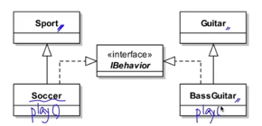
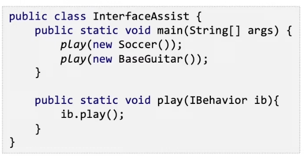
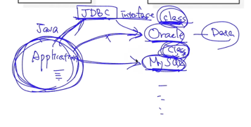

## 다형성
- 자바의 상속 구조는 단일 상속의 원칙을 갖기 때문에 하나의 클래스가 여러 부모 클래스를 상속할 수 없다.
- 서로 다른 부모 클래스를 갖는 클래스간에도 같은 인터페이스를 구현할 수 있다.
  

- 같은 인터페이스를 구현하고 있는 클래스간에는 그 인터페이스로 하여금 대표성을 갖게 할 수 있다.
  

## 인터페이스의 역할
- 하나의 프로그램의 다수의 클래스들이 서로 관계를 형성하게 되고 각 클래스들은 역할에 따라 구분한다.
- 클래스들간에 관계를 밀접하게 구성하게 되면 특정 클래스에서 변경이 일어날 경우 많은 클래스들이 영향을 받는다.
- 따라서, 클래스 간에 관계를 구성할 때 그 관계를 느슨하게 관리하는 것이 중요하다.
- 클래스와 클래스 사이에 인터페이스를 구성하면 직접적인 접근이 없는 느슨한 관계를 구성할 수 있다.

