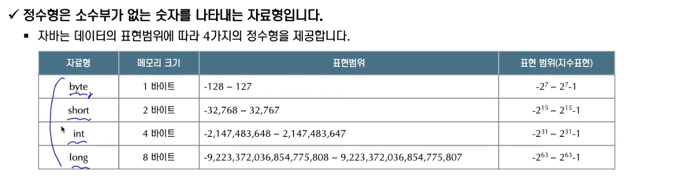
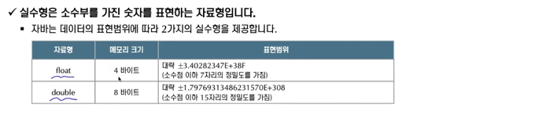
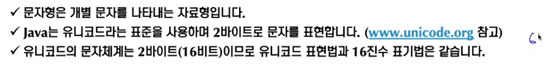
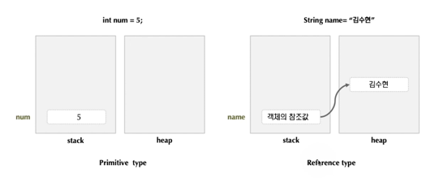

## 자료형(타입)은 변수가 가지는 자료의 종류
- 자바는 자료형 검사가 엄격한 언어이므로, 모든 변수는 자료형을 갖는다.
- 자료형에 따라 할당하는 메모리 크기가 달라진다.

## 자바의 기본 자료형 (Primitive type)
- 정수형 
  - int, short, long, byte
    
    
- 실수형
  - float, double

    
- 문자형
  - char

    
- 부울형
  - boolean

## 상수
- 상수는 값이 변하지 않는 수를 의미하며 자바에서는 두가지 방식으로 상수를 구분한다.
  - 리터럴 상수
    - 155, -5,'a', "Java Programming"
  - 사용자 정의 상수
    - final double PI = 3.141592
- 리터럴 상수도 그 타입에 따라 기본 타입이 정해져 있다.
  - 155, -5와 같은 정수형 타입은 int 타입이다.
  - 0.5, 3.14와 같은 실수 타입은 double 타입이다.
- 사용자 정의 상수는 변수를 선언하고 여기에 final 키워드를 붙이면 한번 초기화 후 그 값을 변경할 수 없다.
  - final double PI = 3.141592

## 참조 자료형
- 참조 자료형을 갖는 변수는 특정 객체의 `참조 정보`를 저장한다.
- 기본 데이터 타입(byte, short, int, long, float, double 등) 이외의 타입을 의미한다.
- 참조 자료형 변수는 4byte의 크기를 가지며 인스턴스 객체에 접근할 수 있는 정보를 갖는다.
- 객체의 삭제는 객체가 더 이상 사용되지 않을 때 Garbage Collector에 의해 자동적으로 제거된다.

