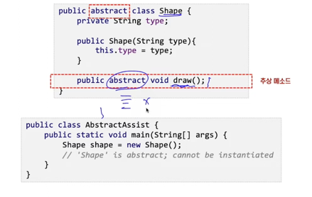
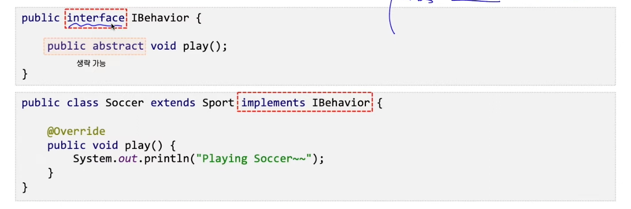
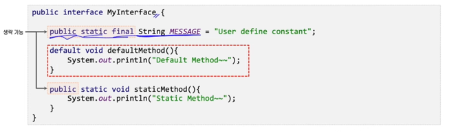

## 추상 클래스(abstract class)의 이해
- 하나 이상의 추상 메서드를 갖는 클래스
- 상속 관계에서 부모 클래스의 역할을 갖기 위한 클래스이며 추상 메서드와 일반 메서드를 가질 수 있다.
- `추상 메서드`는 `메서드의 몸체가 없는 메서드`이며 자식 클래스에서 `재정의` 하도록 하기 위한 메서드이다.
- 추상 클래스는 new 동적 할당자를 통해 인스턴스 객체를 만들 수 없다.
    - 추상 클래스 내부의 생성자는, 자식 클래스를 생성할때만 사용되는 생성자이다.(super()로)

## 인터페이스의 이해 - 개요
- 일반적으로 `추상 메서드만 가지며` interface 키워드를 이용해 정의한다.
- 특정 클래스가 인터페이스를 구현하기 위해선 implements 키워드를 통해 구현한다.
- 상속과 달리 인터페이스는 하나의 클래스가 `둘 이상의 인터페이스를 동시에 구현`할 수 있다. 
- 인터페이스를 통해 설계와 구현을 완전히 분리할 수 있다.

## 자바가 다중 상속을 지원하지 않는 이유
- A라는 클래스가 n(protected)이라는 필드를 가짐.
  - B라는 클래스가 A를 상속함. (A의 n 사용가능)
  - C도 A를 상속함. (A의 n 사용가능)
- 이때, D라는 클래스가 B도 상속, C도 상속함
  - 그럼, D는 n이라는 필드가 두 개가 존재하는 문제 발생(B의 n 인지, C의 n 인지 모름)
- 따라서 단일 상속만 지원한다.

## 인터페이스의 특징
- 필드, 추상 메서드, static 메서드, default 메서드를 정의할 수 있다.
- 인터페이스에 정의하는 모든 필드는 `public static final`(사용자 정의 상수)이 자동으로 적용된다.
- 자바8부터 인터페이스에 static 메서드를 추가할 수 있으며, static 메서드의 사용은 일반 클래스와 동일하다.
- 자바8부터 default 메서드가 추가되었으며 이 메서드는 그 자체로 완전한 메서드이며 구현 클래스는 선택적으로 재정의 할 수 있다.
  - 인터페이스에 하나의 추상 메서드가 추가되면 그를 구현하는 클래스들의 메서드들을 모두 수정하는 노고를 방지함.

